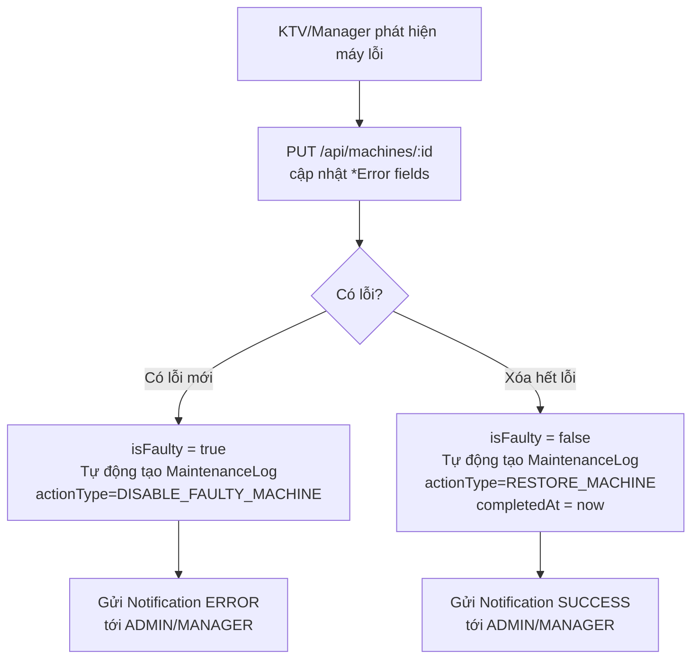
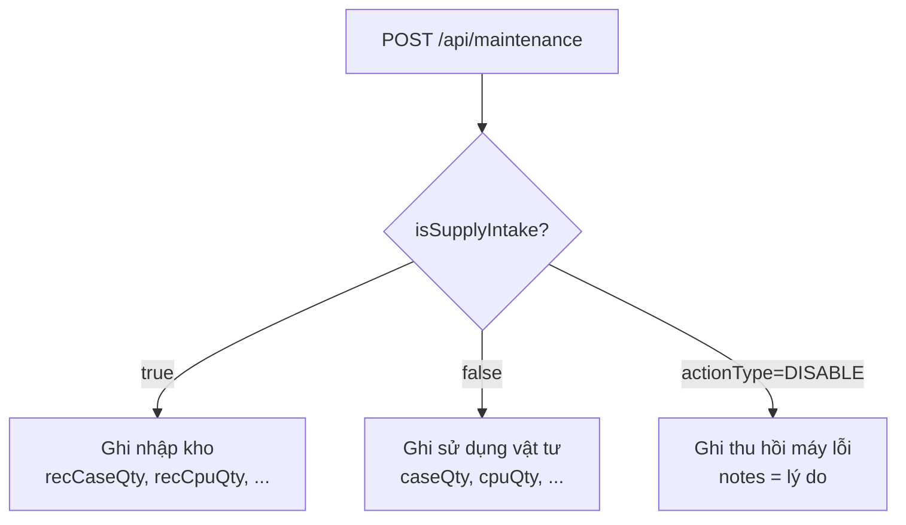
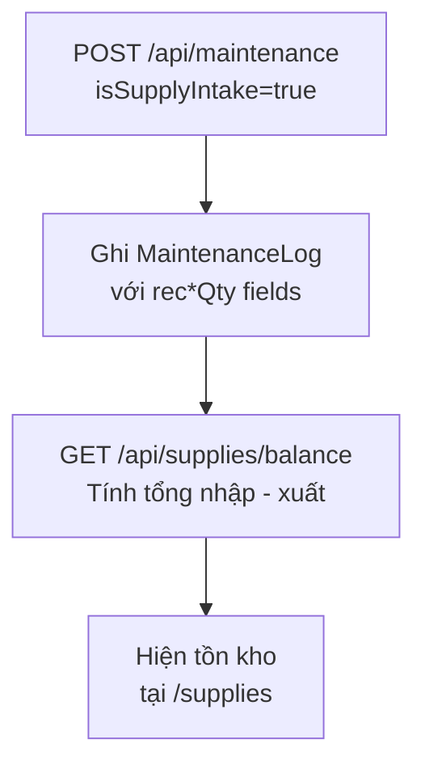
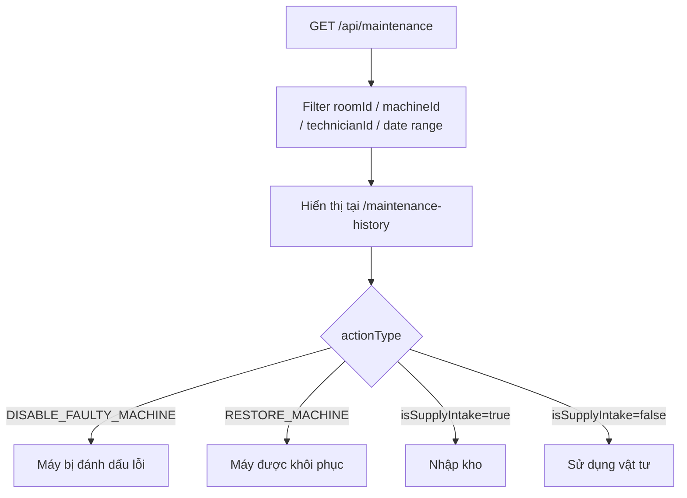

# UPGRADE_PLAN.md — Kế hoạch Nâng cấp Phong May Manager

> **Trạng thái kế hoạch:** ✅ HOÀN CHỈNH — tất cả câu hỏi đã được xác nhận
> **Tiến độ implement:** Phase A ✅ · Phase B ✅ · Phase C ✅ · Phase D ✅ · Phase E ✅
> **Ngày tạo:** 2026-06-10  |  **Ngày cập nhật:** 2026-06-10 (lần 4)
> **Người soạn:** Claude Code (sau khi đọc toàn bộ codebase + xác nhận 10 câu hỏi)

---

## 1. Tóm tắt hệ thống hiện tại

### Stack công nghệ
| Layer | Công nghệ |
|---|---|
| Framework | Next.js 16.2.7 (App Router, hybrid Server/Client) |
| UI | React 19, Tailwind CSS v4, Shadcn UI, Lucide React |
| ORM | Prisma 5.22.0 |
| Database | MySQL |
| Auth | JWT HS256 (jose) + bcrypt + CSRF double-submit cookie |
| Email | Nodemailer (SMTP, cấu hình qua SystemSetting) |
| Logging | Pino |
| Test | Vitest |
| Data Fetch | @tanstack/react-query + axios |

### Các module chính hiện có
| Module | Route frontend | Mục đích |
|---|---|---|
| Dashboard | `/(main)` | Tổng quan ADMIN/MANAGER |
| Phòng máy | `/rooms`, `/rooms/[room]` | Quản lý phòng & máy |
| Bảo trì | `/maintenance` | Tạo bản ghi bảo trì |
| Lịch sử bảo trì | `/maintenance-history` | Xem lịch sử |
| Kỹ thuật viên | `/technicians` | Quản lý KTV |
| Vật tư/Kho | `/supplies` | Tồn kho |
| Phần mềm | `/software` | Danh mục phần mềm |
| Thống kê | `/stats` | Biểu đồ thống kê |
| Thông báo | `/notifications` | Xem thông báo |
| Cài đặt | `/settings` | Profile, User, System, Email, Audit |
| Dashboard KTV | `/dashboard/ktv` | Dashboard riêng TECHNICIAN |

### Các bảng DB hiện có
| Bảng | Mục đích |
|---|---|
| `Floor` | Tầng nhà |
| `Room` | Phòng máy |
| `Machine` | Máy tính (lưu trạng thái lỗi trực tiếp trên bảng) |
| `Software` | Danh mục phần mềm |
| `User` | Tài khoản đăng nhập (ADMIN/MANAGER/TECHNICIAN/GUEST) |
| `UserProfile` | Hồ sơ user (displayName, avatar, phone...) |
| `MaintenanceLog` | Log bảo trì (vật tư, thu hồi, restore, sửa chữa — hiện gộp chung) |
| `Technician` | Kỹ thuật viên **bảng tĩnh** — seeded từ Excel, không có tài khoản login |
| `Notification` | Thông báo in-app |
| `NotificationDebounce` | Debounce cho notif lặp |
| `AuditLog` | Nhật ký kiểm toán |
| `SystemSetting` | Cấu hình hệ thống (SMTP, thời gian quá hạn recall...) |

### Roles hiện tại
| Role | Quyền tóm tắt |
|---|---|
| `ADMIN` | Toàn quyền — quản lý user, cấu hình, xóa mọi thứ |
| `MANAGER` | Quản lý phòng/máy/bảo trì/thông báo, không tạo user |
| `TECHNICIAN` | Tạo bản ghi bảo trì, dashboard riêng |
| `GUEST` | Hiện read-only — sau upgrade: tạo ticket, xem lịch sử ticker của mình, nhận notif phản hồi |

> **Ghi chú quan trọng — Technician vs User:** `Technician` (bảng tĩnh seeded từ Excel) và `User` (tài khoản login) là **hai thực thể tách biệt**. KTV có thể có cả hai (User account role=TECHNICIAN + Technician record), hoặc chỉ có Technician record (không login được). Thiết kế RecallRecord phải xử lý cả hai trường hợp — xem Mục 4.2.

---

## 2. Sơ đồ luồng dữ liệu hiện tại (Mermaid)

### 2.1 Luồng sửa máy (hiện tại)

> **Điểm thiếu:** Không có bước ghi nhận tình trạng TRƯỚC khi sửa. Khi máy được restore, không biết ai sửa, sửa gì, tình trạng ban đầu thế nào.

### 2.2 Luồng Thu hồi (hiện tại — gộp trong MaintenanceLog)

> **Điểm thiếu:** Không phân loại thu hồi, không lưu "ai thu hồi" vs "ai sửa", không cảnh báo thu hồi quá hạn.

### 2.3 Luồng Nhập kho (hiện tại)


### 2.4 Luồng Nhật ký kỹ thuật (hiện tại)


---

## 3. Danh sách thay đổi đề xuất

### Hạng mục 1 — Ghi nhận tình trạng TRƯỚC KHI SỬA
- Thêm bảng `device_pre_repair_status` (bất biến — chỉ INSERT)
- Thêm API `POST/GET /api/pre-repair-status`
- Thêm trang `/pre-repair`: form ghi nhận + danh sách theo máy/phòng
- Upload tối đa 5 ảnh/bản ghi, 5MB/ảnh → `/api/upload/repair-image`

### Hạng mục 2 — Module Thu hồi – Sửa chữa độc lập
- Thêm bảng `recall_records`, `recall_alerts`
- **Thêm cột nullable `recall_record_id` vào `maintenance_logs`** (đã xác nhận — migration ALTER TABLE)
- Trang `/recall` với menu riêng; route `/recall/[id]` cho chi tiết
- Enum `RecallType`: RECALL_FOR_REPAIR | RECALL_STILL_USABLE | RETURN_AFTER_REPAIR
- Alert sau 3 ngày (default, cấu hình qua SystemSetting), lặp lại mỗi 24h cho đến khi sửa xong hoặc admin dismiss
- Cron: **Option B** — crontab OS gọi `POST /api/recalls/check-overdue` (không phụ thuộc app process)

### Hạng mục 3 — Hệ thống Ticker (Guest)
- Thêm bảng `tickets`, `ticket_replies`
- Trang `/tickets` (GUEST+KTV tạo ticker, xem danh sách của mình)
- Trang `/tickets/admin` (ADMIN/MANAGER quản lý, duyệt, gán KTV)
- KTV bật `IN_PROGRESS` khi nhận việc, bật `RESOLVED` khi xong (không approve/reject)
- GUEST nhận notif in-app khi ticket được reply — cần thêm Notification panel cho GUEST
- Ticket khẩn cấp: in-app + email (nếu SMTP đã cấu hình) → chỉ ADMIN và MANAGER

### Hạng mục 4 — Báo cáo đa mẫu
- Mở rộng `/api/report` với nhiều type + bộ lọc (không xóa behavior cũ)
- Export Excel: thêm dependency `exceljs` (đã xác nhận)
- Trang `/reports` với tabs: Máy lỗi / Kho / Linh kiện / KPI thu hồi
- Bộ lọc tùy chọn từ–đến: giới hạn tối đa 1 năm để tránh query nặng

---

## 4. Schema bảng mới

> **Nguyên tắc:** Bảng mới FK sang bảng cũ. Bảng cũ chỉ thêm relation ngược (Prisma only, không ALTER) ngoại trừ `maintenance_logs` đã được xác nhận thêm cột nullable.

### 4.1 `device_pre_repair_status`
Bất biến — chỉ INSERT, không UPDATE/DELETE sau khi tạo.

```prisma
model DevicePreRepairStatus {
  id              Int       @id @default(autoincrement())
  machineId       Int
  roomId          Int                          // Denormalized để query nhanh
  machineNo       Int                          // Denormalized
  description     String    @db.Text
  reportedBy      String?   @db.VarChar(100)   // Tên người báo (free text — có thể là GV)
  reportedAt      DateTime                     // Thời điểm phát hiện (do user nhập)
  imageUrls       String?   @db.Text           // JSON array: ["/uploads/repair-images/xxx.jpg"]
  technicianId    Int?                         // FK → Technician (người ghi nhận)
  createdById     Int                          // FK → User (bắt buộc — người đăng nhập thao tác)
  createdAt       DateTime  @default(now())

  machine     Machine     @relation(fields: [machineId], references: [id])
  room        Room        @relation(fields: [roomId], references: [id])
  technician  Technician? @relation(fields: [technicianId], references: [id])
  createdBy   User        @relation(fields: [createdById], references: [id])

  recallRecords RecallRecord[] // Relation ngược

  @@index([machineId, createdAt])
  @@index([roomId, createdAt])
  @@index([createdById])
  @@map("device_pre_repair_status")
}
```

**Lý do không gộp vào MaintenanceLog:** MaintenanceLog có hàng chục field vật tư + action type phức tạp. Bản ghi tình trạng trước sửa là loại immutable riêng biệt, cần query độc lập theo máy/phòng, và phải giữ tính bất biến — điều MaintenanceLog không đảm bảo (hiện có PUT endpoint).

---

### 4.2 `recall_records`

**Thiết kế dual-reference (xác nhận Q9):** Mỗi bản ghi thu hồi lưu **cả hai**: `*ById` (FK → User, ai login và bấm nút) và `*TechnicianId` (FK → Technician, KTV nào thực hiện trên thực tế). Hai field này có thể trùng nhau (KTV có cả User account và Technician record) hoặc khác nhau (manager login nhưng chỉ định KTV).

```prisma
model RecallRecord {
  id                      Int         @id @default(autoincrement())
  machineId               Int
  roomId                  Int         // Denormalized
  machineNo               Int         // Denormalized
  recallType              RecallType

  // Người thu hồi — dual reference
  recalledById            Int                     // FK → User (ai login thao tác)
  recalledByTechnicianId  Int?                    // FK → Technician (KTV thực thi, nullable nếu người thu hồi là Manager)
  recalledAt              DateTime

  // Người sửa — dual reference
  repairedById            Int?                    // FK → User (ai login nhận sửa)
  repairedByTechnicianId  Int?                    // FK → Technician (KTV thực sửa)
  repairStartedAt         DateTime?
  repairFinishedAt        DateTime?

  preRepairStatusId       Int?                    // FK → DevicePreRepairStatus (link tùy chọn)
  notes                   String?     @db.Text

  createdAt               DateTime    @default(now())
  updatedAt               DateTime    @updatedAt

  machine                 Machine                @relation(fields: [machineId], references: [id])
  room                    Room                   @relation(fields: [roomId], references: [id])
  recalledBy              User                   @relation("RecalledBy", fields: [recalledById], references: [id])
  recalledByTechnician    Technician?            @relation("RecalledByTech", fields: [recalledByTechnicianId], references: [id])
  repairedBy              User?                  @relation("RepairedBy", fields: [repairedById], references: [id])
  repairedByTechnician    Technician?            @relation("RepairedByTech", fields: [repairedByTechnicianId], references: [id])
  preRepairStatus         DevicePreRepairStatus? @relation(fields: [preRepairStatusId], references: [id])
  maintenanceLogs         MaintenanceLog[]       // Relation ngược (sau Migration 5)
  alerts                  RecallAlert[]

  @@index([machineId, createdAt])
  @@index([recalledById])
  @@index([repairedById])
  @@index([recalledByTechnicianId])
  @@index([repairedByTechnicianId])
  @@index([recallType, repairFinishedAt])         // Query KPI: type=FOR_REPAIR & chưa xong
  @@map("recall_records")
}

enum RecallType {
  RECALL_FOR_REPAIR      // Thu hồi để sửa
  RECALL_STILL_USABLE    // Thu hồi nhưng còn dùng được
  RETURN_AFTER_REPAIR    // Trả lại sau khi sửa xong
}
```

---

### 4.3 `recall_alerts`

```prisma
model RecallAlert {
  id              Int          @id @default(autoincrement())
  recallRecordId  Int
  daysOverdue     Int                          // Số ngày quá hạn tại thời điểm alert
  sentAt          DateTime     @default(now())
  dismissedAt     DateTime?                    // Admin dismiss → không alert thêm
  dismissedById   Int?                         // FK → User (ai dismiss)

  recallRecord    RecallRecord @relation(fields: [recallRecordId], references: [id])
  dismissedBy     User?        @relation(fields: [dismissedById], references: [id])

  @@index([recallRecordId, sentAt])
  @@index([dismissedAt])
  @@map("recall_alerts")
}
```

> **Logic alert:** Cron OS chạy hàng ngày → `POST /api/recalls/check-overdue`. API này kiểm tra tất cả `RECALL_FOR_REPAIR` chưa có `repairFinishedAt`, tính số ngày kể từ `recalledAt`. Nếu ≥ threshold (default 3 ngày, lấy từ SystemSetting key `recall_overdue_days`) **VÀ** chưa bị dismiss → tạo `RecallAlert` mới + gửi Notification.

---

### 4.4 `tickets`

```prisma
model Ticket {
  id            Int            @id @default(autoincrement())
  roomId        Int?
  machineNo     Int?
  title         String         @db.VarChar(200)
  description   String         @db.Text
  severity      TicketSeverity @default(MEDIUM)
  status        TicketStatus   @default(PENDING)

  isUrgent      Boolean        @default(false)
  urgentReason  String?        @db.Text        // ← db.Text (không giới hạn VarChar)

  imageUrls     String?        @db.Text        // JSON array, tối đa 5 ảnh

  createdById   Int                            // FK → User (GUEST hoặc TECHNICIAN tạo)
  assignedToId  Int?                           // FK → Technician (gán khi duyệt)

  createdAt     DateTime       @default(now())
  updatedAt     DateTime       @updatedAt

  room          Room?          @relation(fields: [roomId], references: [id])
  createdBy     User           @relation(fields: [createdById], references: [id])
  assignedTo    Technician?    @relation(fields: [assignedToId], references: [id])
  replies       TicketReply[]

  @@index([createdById, status])
  @@index([roomId, status])
  @@index([status, isUrgent, createdAt])        // Urgent tickets nổi lên đầu
  @@map("tickets")
}

enum TicketStatus {
  PENDING      // Đang chờ duyệt (mới tạo)
  APPROVED     // Đã duyệt — ADMIN/MANAGER reply
  REJECTED     // Bị từ chối — ADMIN/MANAGER reply kèm lý do
  IN_PROGRESS  // Đang xử lý — KTV được gán bật khi nhận việc
  RESOLVED     // Đã xử lý xong — KTV bật khi hoàn thành
}

enum TicketSeverity {
  LOW
  MEDIUM
  HIGH
  CRITICAL
}
```

---

### 4.5 `ticket_replies`

```prisma
model TicketReply {
  id            Int           @id @default(autoincrement())
  ticketId      Int
  content       String        @db.Text
  statusChange  TicketStatus?                  // Reply này có thể thay đổi status ticket
  createdById   Int                            // FK → User (ADMIN, MANAGER, hoặc TECHNICIAN)
  createdAt     DateTime      @default(now())

  ticket        Ticket        @relation(fields: [ticketId], references: [id])
  createdBy     User          @relation(fields: [createdById], references: [id])

  @@index([ticketId, createdAt])
  @@map("ticket_replies")
}
```

**Ma trận chuyển đổi trạng thái ticket:**
| Từ → Tới | Ai được phép | Ghi chú |
|---|---|---|
| `PENDING` → `APPROVED` | ADMIN, MANAGER | Reply kèm nội dung + tùy chọn gán KTV |
| `PENDING` → `REJECTED` | ADMIN, MANAGER | Reply phải có lý do |
| `APPROVED` → `IN_PROGRESS` | TECHNICIAN (được gán), ADMIN, MANAGER | KTV nhận việc |
| `IN_PROGRESS` → `RESOLVED` | TECHNICIAN (được gán), ADMIN, MANAGER | KTV xong việc |
| `RESOLVED` → `IN_PROGRESS` | ADMIN, MANAGER | Reopen nếu chưa thực sự xong |
| Bất kỳ → `REJECTED` | ADMIN, MANAGER | Override trong trường hợp đặc biệt |

**GUEST và TECHNICIAN không tạo được gán:** Khi tạo reply, TECHNICIAN chỉ được gửi `statusChange = IN_PROGRESS` hoặc `RESOLVED` (validate server-side). GUEST không được reply.

---

### 4.6 `report_snapshots` (Phase D — optional cache)

```prisma
model ReportSnapshot {
  id          Int      @id @default(autoincrement())
  reportType  String   @db.VarChar(50)
  periodStart DateTime
  periodEnd   DateTime
  filters     String?  @db.Text
  data        String   @db.LongText
  generatedAt DateTime @default(now())
  expiresAt   DateTime

  @@index([reportType, periodStart, periodEnd])
  @@index([expiresAt])
  @@map("report_snapshots")
}
```

---

### Bảng cũ — thay đổi được xác nhận

| Bảng | Loại thay đổi | Chi tiết |
|---|---|---|
| `maintenance_logs` | **ALTER TABLE — thêm cột nullable** | `recall_record_id INT NULL FK → recall_records(id) ON DELETE SET NULL` |
| `Machine` | Relation ngược (Prisma only) | `preRepairStatuses`, `recallRecords` |
| `Room` | Relation ngược (Prisma only) | `tickets`, `preRepairStatuses` |
| `User` | Relation ngược (Prisma only) | `tickets`, `ticketReplies`, `recalledRecords`, `repairedRecords`, `recallAlertDismissals` |
| `Technician` | Relation ngược (Prisma only) | `tickets`, `preRepairStatuses`, `recalledTechRecords`, `repairedTechRecords` |

> Relation ngược trong Prisma schema không thay đổi DB vật lý — Prisma chỉ dùng để query, không tạo thêm cột hay index.

---

## 5. Danh sách API mới

### 5.1 Pre-Repair Status

| Method | Route | Mô tả | Roles |
|---|---|---|---|
| `POST` | `/api/pre-repair-status` | Tạo bản ghi tình trạng trước sửa | TECHNICIAN, MANAGER, ADMIN |
| `GET` | `/api/pre-repair-status` | Danh sách (filter: machineId, roomId, from, to) | TECHNICIAN, MANAGER, ADMIN |
| `GET` | `/api/pre-repair-status/[id]` | Chi tiết 1 bản ghi | TECHNICIAN, MANAGER, ADMIN |
| `POST` | `/api/upload/repair-image` | Upload ảnh (max 5 files, 5MB/file) | TECHNICIAN, MANAGER, ADMIN |

```jsonc
// POST /api/pre-repair-status
{
  "machineId": 1,
  "description": "Màn hình không lên, quạt kêu to",
  "reportedBy": "Thầy Nguyễn Văn A",
  "reportedAt": "2026-06-10T08:00:00Z",
  "imageUrls": ["/uploads/repair-images/abc.jpg"],
  "technicianId": 3   // optional — Technician record
}
```

---

### 5.2 Recall Records

| Method | Route | Mô tả | Roles |
|---|---|---|---|
| `GET` | `/api/recalls` | Danh sách (filter: type, roomId, dateRange, overdue) | ALL authed |
| `POST` | `/api/recalls` | Tạo bản ghi thu hồi | TECHNICIAN, MANAGER, ADMIN |
| `GET` | `/api/recalls/[id]` | Chi tiết | ALL authed |
| `PUT` | `/api/recalls/[id]` | Cập nhật (nhận sửa, xong sửa, đổi type) | TECHNICIAN (của mình), MANAGER, ADMIN |
| `GET` | `/api/recalls/alerts` | Danh sách alert quá hạn chưa dismiss | ADMIN, MANAGER |
| `PUT` | `/api/recalls/alerts/[id]/dismiss` | Admin dismiss một alert | ADMIN, MANAGER |
| `POST` | `/api/recalls/check-overdue` | Endpoint cho cron OS gọi | Internal (API key header) |
| `GET` | `/api/recalls/stats` | Thống kê KPI theo KTV (xem Mục 11) | ADMIN, MANAGER |

```jsonc
// POST /api/recalls
{
  "machineId": 42,
  "recallType": "RECALL_FOR_REPAIR",
  "recalledAt": "2026-06-10T09:00:00Z",
  "recalledByTechnicianId": 3,    // optional
  "preRepairStatusId": 15,        // optional
  "notes": "CPU bị cháy"
}

// PUT /api/recalls/[id] — nhận sửa
{
  "repairedById": 5,
  "repairedByTechnicianId": 3,
  "repairStartedAt": "2026-06-10T10:00:00Z"
}

// PUT /api/recalls/[id] — xong sửa
{
  "repairFinishedAt": "2026-06-10T14:00:00Z"
}
```

---

### 5.3 Tickets

| Method | Route | Mô tả | Roles |
|---|---|---|---|
| `GET` | `/api/tickets` | GUEST/KTV: chỉ của mình. ADMIN/MGR: tất cả | ALL authed |
| `POST` | `/api/tickets` | Tạo ticket mới | GUEST, TECHNICIAN, MANAGER, ADMIN |
| `GET` | `/api/tickets/[id]` | Chi tiết + replies | ALL (GUEST guard chỉ ticket của mình) |
| `POST` | `/api/tickets/[id]/reply` | Phản hồi (có thể đổi status) | ADMIN, MANAGER, TECHNICIAN* |
| `PUT` | `/api/tickets/[id]` | Gán KTV, force đổi status | ADMIN, MANAGER |
| `GET` | `/api/tickets/unresolved-count` | Badge số cho menu | ADMIN, MANAGER |
| `POST` | `/api/upload/ticket-image` | Upload ảnh (max 5 files, 5MB/file) | GUEST, TECHNICIAN, MANAGER, ADMIN |

> *TECHNICIAN reply: chỉ được dùng `statusChange = IN_PROGRESS` hoặc `RESOLVED`. Server validate và reject nếu gửi APPROVED/REJECTED.

> *TECHNICIAN xem: chỉ ticket có `assignedToId` khớp với Technician record của mình (admin gán trực tiếp vào ticket khi duyệt). Không có bảng Room↔Technician riêng.

```jsonc
// POST /api/tickets
{
  "roomId": 3,
  "machineNo": 12,
  "title": "Máy 12 P.B202 không lên màn hình",
  "description": "Bật máy lên nhưng màn hình tối hoàn toàn...",
  "severity": "HIGH",
  "isUrgent": true,
  "urgentReason": "Buổi chiều có 60 SV thi, không có máy dự phòng",
  "imageUrls": []
}

// POST /api/tickets/[id]/reply — ADMIN duyệt và gán KTV
{
  "content": "Đã tiếp nhận, KTV Minh sẽ xử lý trong 30 phút.",
  "statusChange": "APPROVED",
  "assignToTechnicianId": 3    // optional — gán KTV lúc duyệt
}

// POST /api/tickets/[id]/reply — KTV nhận việc
{
  "content": "Đã nhận, đang kiểm tra.",
  "statusChange": "IN_PROGRESS"
}
```

---

### 5.4 Reports (mở rộng API cũ)

| Method | Route | Mô tả | Roles |
|---|---|---|---|
| `GET` | `/api/report?type=machines` | Báo cáo máy lỗi | ADMIN, MANAGER |
| `GET` | `/api/report?type=supply` | Báo cáo kho | ADMIN, MANAGER |
| `GET` | `/api/report?type=parts-usage` | Báo cáo linh kiện | ADMIN, MANAGER |
| `GET` | `/api/report?type=recall-kpi` | KPI thu hồi-sửa chữa | ADMIN, MANAGER |
| `GET` | `/api/report/export` | Export PDF hoặc Excel | ADMIN, MANAGER |

**Query params chung:** `period=day|week|month|custom`, `from=ISO8601`, `to=ISO8601` (max 365 ngày nếu custom), `roomId=`, `technicianId=`

```
GET /api/report/export?type=recall-kpi&period=month&format=excel
GET /api/report/export?type=machines&from=2026-01-01&to=2026-06-30&format=pdf
```

---

## 6. Danh sách màn hình / route frontend mới

| Route | Tên trang | Roles | Mô tả |
|---|---|---|---|
| `/pre-repair` | Ghi nhận trước sửa | TECH, MGR, ADMIN | Form tạo + danh sách theo máy/phòng |
| `/recall` | Thu hồi – Sửa chữa | TECH, MGR, ADMIN | Bảng tất cả lần thu hồi + filter + tạo mới |
| `/recall/[id]` | Chi tiết thu hồi | TECH (của mình), MGR, ADMIN | Timeline tiến trình + cập nhật |
| `/tickets` | Ticker của tôi | TẤT CẢ | GUEST/KTV: tạo + xem của mình; ADMIN/MGR: redirect sang /tickets/admin |
| `/tickets/[id]` | Chi tiết ticker | TẤT CẢ (guard theo role) | Lịch sử phản hồi + reply form |
| `/tickets/admin` | Quản lý ticker | ADMIN, MANAGER | Danh sách tất cả, filter, duyệt, gán KTV |
| `/reports` | Báo cáo đa mẫu | ADMIN, MANAGER | Tabs + date range + export |

### Điều chỉnh Shell component (menu)
| Mục menu | Hiển thị cho | Đặc biệt |
|---|---|---|
| "Thu hồi – Sửa chữa" → `/recall` | ADMIN, MANAGER, TECHNICIAN | — |
| "Ghi nhận trước sửa" → `/pre-repair` | ADMIN, MANAGER, TECHNICIAN | — |
| "Ticker" → `/tickets` | TẤT CẢ | Badge đếm ticket chưa duyệt (chỉ ADMIN/MANAGER thấy badge) |
| "Báo cáo" → `/reports` | ADMIN, MANAGER | — |

### GUEST — trang và notification
- GUEST truy cập `/tickets` để tạo và xem lịch sử ticker của mình.
- GUEST **không dùng** Notification panel. Phản hồi ticket được xem trực tiếp tại `/tickets/[id]` — đây là đủ.

---

## 7. Các điểm rủi ro & ảnh hưởng tới luồng cũ

### 7.1 MaintenanceLog — rủi ro: THẤP
- Thêm cột nullable `recall_record_id` → backward compatible hoàn toàn.
- Tất cả bản ghi cũ sẽ có `recall_record_id = NULL` — không ảnh hưởng query hiện tại.
- Rollback: `ALTER TABLE maintenance_logs DROP FOREIGN KEY ...; DROP COLUMN recall_record_id`.

### 7.2 Machine — rủi ro: THẤP
- Chỉ thêm relation ngược trong Prisma schema — zero DB change.
- `PUT /api/machines/[id]` không bị ảnh hưởng.

### 7.3 Notifications — rủi ro: THẤP
- Reuse `sendNotification()` cho: ticket mới → ADMIN/MANAGER; ticket reply → GUEST/KTV; recall alert → ADMIN/MANAGER.
- Debounce key cho recall: `recall_alert_{recallId}_{date}` (reset mỗi ngày để alert lặp lại).
- **Chú ý:** Cần kiểm tra GUEST có `userId` hợp lệ trong bảng `Notification` — hiện schema cho phép, chỉ cần không bị guard ở UI layer.

### 7.4 GUEST role — rủi ro: TRUNG BÌNH
- Hiện GUEST không có trang riêng, không nhận notif.
- Upgrade thêm: POST ticket, GET ticket (của mình), xem Notification.
- Guard tuyệt đối: GUEST **không được** truy cập `/tickets/admin`, `/recall`, `/pre-repair`, `/reports`.

### 7.5 Technician ↔ User resolution — rủi ro: TRUNG BÌNH
- Khi TECHNICIAN tạo RecallRecord, server cần tự resolve `recalledByTechnicianId` từ `User.id` → `Technician.id`.
- Hiện tại không có FK trực tiếp giữa `User` và `Technician`. Cần query: tìm `Technician` có `name` khớp `User.profile.displayName` hoặc thêm cột `userId` vào bảng `Technician`.
- **Đề xuất:** Thêm cột nullable `userId` vào bảng `Technician` (Migration 5b) để liên kết 1-1. Nếu KTV không có account thì `userId = NULL`.
- **⚠️ Cần xác nhận thêm:** Xem Mục 10 — câu hỏi bổ sung.

### 7.6 Report API — rủi ro: THẤP
- `GET /api/report` hiện có → giữ nguyên behavior, chỉ thêm `type` và `period` params.
- Thêm `/api/report/export` riêng cho multi-format → không conflict.

### 7.7 Cron job — rủi ro: THẤP
- Option B: crontab OS gọi `POST /api/recalls/check-overdue` với API key trong header.
- Endpoint này cần **không yêu cầu JWT** nhưng phải validate `X-Internal-Key` header (thêm vào `.env`).
- Nếu Next.js restart, cron vẫn chạy bình thường vì không phụ thuộc process.

---

## 8. Kế hoạch Migration & Rollback

### 8.1 Thứ tự migration

```
Migration 1: add_device_pre_repair_status
  ├── CREATE TABLE device_pre_repair_status
  └── Rollback: DROP TABLE device_pre_repair_status

Migration 2: add_recall_records_and_alerts
  ├── CREATE ENUM RecallType
  ├── CREATE TABLE recall_records
  ├── CREATE TABLE recall_alerts
  └── Rollback: DROP TABLE recall_alerts; DROP TABLE recall_records; DROP ENUM

Migration 3: add_tickets_and_replies
  ├── CREATE ENUM TicketStatus, TicketSeverity
  ├── CREATE TABLE tickets
  ├── CREATE TABLE ticket_replies
  └── Rollback: DROP TABLE ticket_replies; DROP TABLE tickets; DROP ENUMs

Migration 4: add_recall_id_to_maintenance_log   ← ĐÃ CONFIRM (không optional nữa)
  ├── ALTER TABLE maintenance_logs ADD COLUMN recall_record_id INT NULL
  ├── ALTER TABLE maintenance_logs ADD CONSTRAINT FK recall_record_id → recall_records(id) ON DELETE SET NULL
  └── Rollback: DROP FOREIGN KEY; DROP COLUMN recall_record_id

Migration 5 (ĐÃ CONFIRM): add_user_id_to_technician
  ├── ALTER TABLE technicians ADD COLUMN user_id INT NULL UNIQUE
  ├── ADD FOREIGN KEY user_id → users(id) ON DELETE SET NULL
  └── Rollback: DROP FOREIGN KEY; DROP COLUMN user_id

Migration 6 (optional, Phase D): add_report_snapshots
  ├── CREATE TABLE report_snapshots
  └── Rollback: DROP TABLE report_snapshots
```

### 8.2 Cách chạy
```bash
npx prisma migrate dev --name <ten_migration>   # dev
npx prisma migrate deploy                        # prod
npx prisma migrate status                        # kiểm tra
```

### 8.3 Rollback strategy
- Toàn bộ thay đổi là **additive** (bảng mới + nullable columns) → rollback chỉ cần DROP, không mất dữ liệu cũ.
- Backup trước mỗi migration prod: `bash scripts/backup-db.sh`.
- Verify sau mỗi migration: `prisma migrate status` + `GET /api/health`.

---

## 9. Thứ tự triển khai

```
✅ Phase A — Nền tảng pre-repair (DONE — commit 56ce3cf)
  ├── ✅ A1. Migration 1: device_pre_repair_status
  ├── ✅ A2. API: POST/GET /api/pre-repair-status
  ├── ✅ A3. API: POST /api/upload/repair-image
  └── ✅ A4. UI: /pre-repair (form + danh sách)

✅ Phase B — Thu hồi (DONE — commit a9950c9)
  ├── ✅ B1. Migration 2: recall_records (có complexity field) + recall_alerts
  ├── ✅ B2. Migration 4: add recall_record_id to maintenance_logs
  ├── ✅ B3. Migration 5: add user_id to technicians
  ├── ✅ B4. API: CRUD /api/recalls + /api/recalls/alerts + /api/recalls/check-overdue + /api/recalls/stats
  ├── ✅ B5. UI: /recall + /recall/[id]
  ├── ✅ B6. Cron setup: crontab.example + INTERNAL_CRON_KEY vào .env.example
  └── ✅ B7. Notification: recall alert → ADMIN/MANAGER (qua check-overdue endpoint)

✅ Phase C — Ticker (DONE — 2026-06-10)
  ├── ✅ C1. Migration 3: tickets + ticket_replies (có guestReadAt)
  ├── ✅ C2. API: CRUD /api/tickets + /api/tickets/[id]/reply + /api/tickets/unresolved-count
  ├── ✅ C3. API: POST /api/upload/ticket-image + GET /api/ticket-image/[filename]
  ├── ✅ C4. UI: /tickets (guest+ktv) + /tickets/admin + /tickets/[id]
  ├── ✅ C5. Notification: ticket tạo → ADMIN/MANAGER (+ email nếu urgent); reply → người tạo + KTV được gán
  └── ✅ C6. Shell: badge PENDING count (ADMIN/MGR) + badge unread reply (GUEST), refresh 60s

✅ Phase D — Báo cáo (DONE — 2026-06-10)
  ├── ✅ D1. Mở rộng /api/report với type+period params (machines/supply/parts-usage/recall-kpi)
  ├── ✅ D2. Thêm exceljs dependency + /api/report/export (Excel multi-sheet)
  ├── ✅ D3. UI: /reports với 4 tabs + date range filter + export button
  └── ⏳ D4. (Optional) Migration 6: report_snapshots + cache logic — bỏ qua

✅ Phase E — Kiểm thử & Hoàn thiện (DONE — 2026-06-10)
  ├── ✅ E1. Unit test: getMachineStatus, getMachineColor (machine-utils)
  ├── ✅ E2. Integration test: pre-repair API (GET filter, POST validation + CSRF + audit)
  ├── ✅ E3. Integration test: recall API (POST validation, TECHNICIAN auto-resolve tech, check-overdue + debounce)
  ├── ✅ E4. Integration test: ticket API (GUEST filter, TECHNICIAN OR condition, urgent→ERROR notification)
  ├── ✅ E5. Integration test: report API (date range validation, type routing, legacy mode, period presets)
  └── ⏳ E6. Cập nhật README — bỏ qua (không yêu cầu)
```

**Lý do thứ tự:** Phase A trước vì recall tham chiếu `preRepairStatusId`. Phase B+C có thể chạy song song vì độc lập. Phase D cần dữ liệu thực từ A+B+C để test báo cáo có ý nghĩa.

---

## 10. Quyết định đã xác nhận

| # | Câu hỏi | Quyết định |
|---|---|---|
| 1 | Recall quá hạn bao nhiêu ngày? Alert bao lâu? | 3 ngày, cấu hình qua SystemSetting key `recall_overdue_days`. Alert lặp mỗi 24h cho đến khi có `repairFinishedAt` hoặc admin dismiss. |
| 2 | Liên kết MaintenanceLog ↔ RecallRecord? | **Có** — thêm `recall_record_id` nullable vào `maintenance_logs` (Migration 4). |
| 3 | Cron scheduler? | **Option B** — crontab OS gọi `POST /api/recalls/check-overdue` với `X-Internal-Key` header. |
| 4 | TECHNICIAN với ticket? | (a) Có thể tạo ticket. (b) Chỉ xem ticket phòng được phân công. (c) Có thể reply với `IN_PROGRESS` / `RESOLVED`, không approve/reject. |
| 5 | Gán KTV khi duyệt? | **Có** — dropdown chọn Technician trong form reply APPROVED, KTV được gán nhận notification. |
| 6 | Excel dependency? | **Cho phép thêm `exceljs`**. |
| 7 | Giới hạn ảnh upload? | Tối đa **5 ảnh/bản ghi**, **5MB/ảnh** — đồng bộ với giới hạn avatar hiện tại. |
| 8 | Ticket khẩn cấp thông báo cho ai? | ADMIN + MANAGER in-app notification. Nếu SMTP đã cấu hình → gửi email thêm. Không gửi cho ai khác. |
| 9 | recalled_by / repaired_by → User hay Technician? | **Cả hai**: `*ById` (FK → User, ai login bấm nút) + `*TechnicianId` (FK → Technician, KTV thực thi). |
| 10 | Báo cáo tùy chọn from-to? | **Có**, giới hạn tối đa **365 ngày** để tránh query nặng. |

---

## 11. Chi tiết bổ sung sau xác nhận

### 11.1 Công thức KPI cho báo cáo lương thưởng (`/api/recalls/stats`)

Response cho mỗi KTV trong khoảng thời gian:
```jsonc
{
  "technicianId": 3,
  "technicianName": "Nguyễn Văn Minh",
  "period": { "from": "2026-06-01", "to": "2026-06-30" },

  // Số lần thu hồi
  "totalRecalls": 12,
  "recallsByType": {
    "RECALL_FOR_REPAIR": 8,
    "RECALL_STILL_USABLE": 3,
    "RETURN_AFTER_REPAIR": 1
  },

  // Số lần sửa thành công (có repairFinishedAt)
  "totalRepairsCompleted": 7,
  "repairsInProgress": 1,        // Bắt đầu nhưng chưa xong
  "repairsNotStarted": 0,        // Được gán nhưng chưa bắt đầu

  // Thời gian sửa (chỉ tính bản ghi RECALL_FOR_REPAIR đã có cả started và finished)
  "avgRepairMinutes": 127,        // Trung bình số phút từ repairStartedAt đến repairFinishedAt
  "minRepairMinutes": 30,
  "maxRepairMinutes": 480,

  // Thời gian phản hồi (từ recalledAt đến repairStartedAt)
  "avgResponseMinutes": 45
}
```

> **Lưu ý:** Công thức trọng số theo "độ khó" chưa có dữ liệu để tính → **Phase 1 chỉ tính số lần và thời gian thô**. Trọng số có thể bổ sung sau khi có thêm field `complexity` hoặc liên kết với loại linh kiện thay thế.

### 11.2 Notification triggers mới

| Sự kiện | Gửi cho | Loại | Debounce |
|---|---|---|---|
| Ticket mới tạo (thường) | ADMIN, MANAGER | `INFO` | Không |
| Ticket mới tạo (khẩn cấp) | ADMIN, MANAGER | `ERROR` + email | Không |
| Ticket được APPROVED | User tạo ticket | `SUCCESS` | Không |
| Ticket được REJECTED | User tạo ticket | `WARNING` | Không |
| Ticket được reply (bất kỳ) | User tạo ticket | `INFO` | Không |
| KTV được gán ticket | KTV (User account) | `INFO` | Không |
| Recall quá hạn (N ngày) | ADMIN, MANAGER | `WARNING` | Key: `recall_alert_{id}_{date}` — mỗi 24h |

### 11.3 Quyết định bổ sung (xác nhận 2026-06-10)

| # | Câu hỏi | Quyết định |
|---|---|---|
| B1 | Thêm `userId` nullable vào `Technician`? | **Có** — Migration 5 được xác nhận. Server dùng để resolve `*TechnicianId` khi KTV login. |
| B2 | Phân công phòng cho KTV quản lý ở đâu? | **Admin gán trực tiếp vào ticket** (`assignedToId`). TECHNICIAN thấy ticket khi `assignedToId` khớp với Technician record của họ. Không cần bảng Room↔Technician riêng. |
| B3 | GUEST có cần `/notifications` không? | **Không** — GUEST chỉ xem phản hồi ngay trong trang `/tickets/[id]`. Không cần Notification panel riêng cho GUEST. |
| B4 | GUEST biết có reply mới bằng cách nào? | **Badge `hasUnreadReply`** trên menu item "Ticker" — API `/api/tickets` trả thêm field `hasUnreadReply: boolean` (hoặc `unreadReplies: number`) cho GUEST. |
| B5 | KPI Phase 2 tính theo gì? | **Trọng số theo `complexity`** — thêm field `complexity ENUM(LOW, MEDIUM, HIGH)` vào `recall_records` ngay từ Migration 2 để chừa chỗ. Phase 1 chỉ report số lần/thời gian thô. Phase 2 nhân trọng số: LOW=1, MEDIUM=2, HIGH=3. |
| B6 | Auto-resolve ticket khi repair xong? | **Có** — khi `RecallRecord.repairFinishedAt` được set và ticket có liên kết đang `IN_PROGRESS` → server tự chuyển ticket sang `RESOLVED`. |

---

## 12. Phụ lục — Mapping file thay đổi

| File/Thư mục | Loại thay đổi |
|---|---|
| `prisma/schema.prisma` | Thêm 5-6 model + enums + relations ngược |
| `prisma/migrations/` | 4-6 migration mới |
| `src/app/api/pre-repair-status/` | Mới hoàn toàn |
| `src/app/api/recalls/` | Mới hoàn toàn (bao gồm `check-overdue`, `alerts`, `stats`) |
| `src/app/api/tickets/` | Mới hoàn toàn (bao gồm `[id]/reply`, `unresolved-count`) |
| `src/app/api/upload/repair-image/` | Mới (clone + điều chỉnh từ avatar upload) |
| `src/app/api/upload/ticket-image/` | Mới |
| `src/app/api/report/route.ts` | Mở rộng params, không break cũ |
| `src/app/api/report/export/route.ts` | Mới — multi-format export |
| `src/app/(main)/pre-repair/` | Trang mới |
| `src/app/(main)/recall/` | Trang mới (index + [id]) |
| `src/app/(main)/tickets/` | Trang mới (index + admin + [id]) |
| `src/app/(main)/reports/` | Trang mới |
| `src/components/app/shell.tsx` | Thêm 4 menu items + badge |
| `src/lib/node/notification.ts` | Thêm triggers mới |
| `src/lib/app-data.ts` | Thêm constants/types mới |
| `.env.example` | Thêm `INTERNAL_CRON_KEY` |
| `crontab.example` | File mới — ví dụ crontab setup |
| **Không sửa** | Tất cả API route hiện có, DB columns cũ |

---

*File này là kế hoạch sống — cập nhật khi có thay đổi quyết định. Mọi thay đổi schema hoặc API phải ghi lại lý do trong file này trước khi code.*
